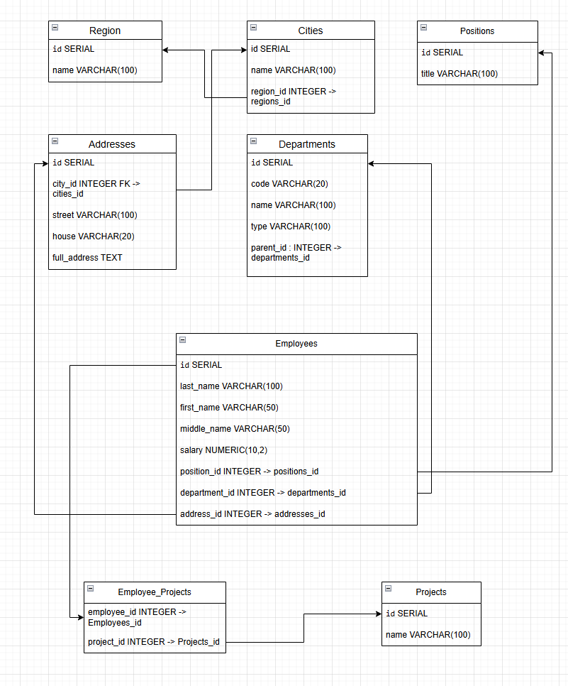

# sdb-homeworks12-1

### Легенда

Заказчик передал вам [файл в формате Excel](https://github.com/netology-code/sdb-homeworks/blob/main/resources/hw-12-1.xlsx), в котором сформирован отчёт. 

На основе этого отчёта нужно выполнить следующие задания.

### Задание 1

Опишите не менее семи таблиц, из которых состоит база данных. Определите:

- какие данные хранятся в этих таблицах,
- какой тип данных у столбцов в этих таблицах, если данные хранятся в PostgreSQL.

Начертите схему полученной модели данных. Можете использовать онлайн-редактор: https://app.diagrams.net/

Этапы реализации:
1.	Внимательно изучите предоставленный вам файл с данными и подумайте, как можно сгруппировать данные по смыслу.
2.	Разбейте исходный файл на несколько таблиц и определите список столбцов в каждой из них. 
3.	Для каждого столбца подберите подходящий тип данных из PostgreSQL. 
4.	Для каждой таблицы определите первичный ключ (PRIMARY KEY).
5.	Определите типы связей между таблицами. 
6.	Начертите схему модели данных.
На схеме должны быть чётко отображены:
   - все таблицы с их названиями,
   - все столбцы  с указанием типов данных,
   - первичные ключи (они должны быть явно выделены),
   - линии, показывающие связи между таблицами.

**Результатом выполнения задания** должен стать скриншот получившейся схемы базы данных.

### Решение Задание 1




### Задание 2*

1. Разверните СУБД Postgres на своей хостовой машине, на виртуальной машине или в контейнере docker.
2. Опишите схему, полученную в предыдущем задании, с помощью скрипта SQL.
3. Создайте в вашей полученной СУБД новую базу данных и выполните полученный ранее скрипт для создания вашей модели данных.

В качестве решения приложите SQL скрипт и скриншот диаграммы.

Для написания и редактирования sql удобно использовать  специальный инструмент dbeaver.

### Решение Задание 2

```
CREATE TABLE regions (
    id SERIAL PRIMARY KEY,
    name VARCHAR(100) NOT NULL UNIQUE
);

CREATE TABLE cities (
    id SERIAL PRIMARY KEY,
    name VARCHAR(100) NOT NULL,
    region_id INTEGER NOT NULL REFERENCES regions(id)
);

CREATE TABLE addresses (
    id SERIAL PRIMARY KEY,
    city_id INTEGER NOT NULL REFERENCES cities(id),
    street VARCHAR(100) NOT NULL,
    house VARCHAR(20) NOT NULL,
    full_address TEXT
);

CREATE TABLE departments (
    id SERIAL PRIMARY KEY,
    code VARCHAR(20),
    name VARCHAR(100) NOT NULL,
    type VARCHAR(100),
    parent_id INTEGER REFERENCES departments(id)
);

CREATE TABLE positions (
    id SERIAL PRIMARY KEY,
    title VARCHAR(100) NOT NULL UNIQUE
);

CREATE TABLE projects (
    id SERIAL PRIMARY KEY,
    name VARCHAR(100) NOT NULL UNIQUE
);

CREATE TABLE employees (
    id SERIAL PRIMARY KEY,
    last_name VARCHAR(100) NOT NULL,
    first_name VARCHAR(50) NOT NULL,
    middle_name VARCHAR(50),
    salary NUMERIC(10,2),
    position_id INTEGER NOT NULL REFERENCES positions(id),
    department_id INTEGER NOT NULL REFERENCES departments(id),
    address_id INTEGER NOT NULL REFERENCES addresses(id)
);

CREATE TABLE employee_projects (
    employee_id INTEGER NOT NULL REFERENCES employees(id),
    project_id INTEGER NOT NULL REFERENCES projects(id),
    PRIMARY KEY (employee_id, project_id)
);
```